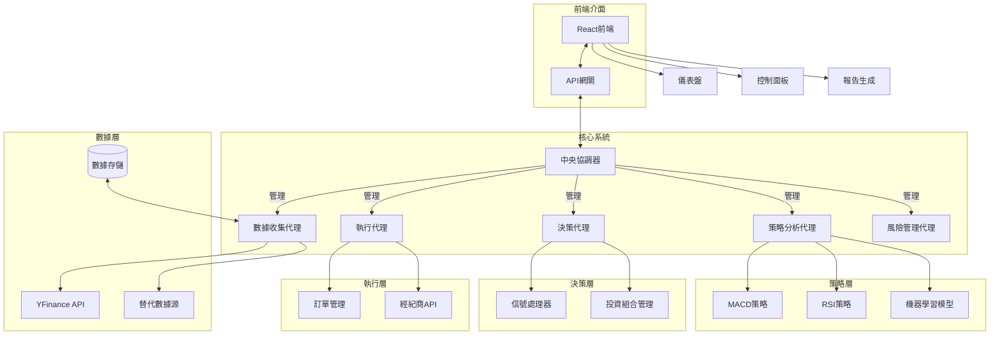

# SiuBiu-AI-Quant-System

在做了在做了, 這是個 Ai Quant System

## 文件架構

```
SIUBIU-AI-QUANT-SYSTEM
├── backend/                    # 後端核心代碼
│   ├── agents/                # 各種代理實現
│   │   ├── __init__.py
│   │   ├── coordinator.py     # 中央協調器
│   │   ├── base_agent.py     # 代理基類
│   │   ├── data_agent.py     # 數據收集代理
│   │   ├── macd_agent.py     # MACD 策略代理
│   │   ├── decision_agent.py # 決策代理
│   │   ├── execution_agent.py# 執行代理
│   │   └── risk_agent.py     # 風險管理代理
│   ├── lib/                   # 通用工具庫
│   │   ├── __init__.py
│   │   ├── indicators.py     # 技術指標實現
│   │   └── analysis.py       # 分析工具
│   ├── api/                   # API 接口
│   │   ├── __init__.py
│   │   └── main.py          # 主要 API 端點
│   └── config.py             # 配置文件
├── frontend/                  # 前端代碼
│   ├── public/               # 靜態資源
│   ├── src/                  # 源代碼
│   │   ├── components/       # React 組件
│   │   │   ├── Dashboard.js  # 儀表盤組件
│   │   │   ├── ControlPanel.js# 控制面板
│   │   │   ├── TradeHistory.js# 交易歷史
│   │   │   └── Portfolio.js  # 投資組合
│   │   ├── App.js           # 主應用
│   │   ├── index.js         # 入口文件
│   │   └── styles/          # 樣式文件
│   ├── package.json         # 依賴配置
│   └── README.md            # 前端文檔
├── rust_modules/            # Rust 擴展模塊（可選）
│   ├── Cargo.toml          # Rust 項目配置
│   └── src/
│       └── lib.rs          # Rust 代碼
├── requirements.txt         # Python 依賴
├── setup.py                # 安裝配置
└── README.md               # 項目主文檔
```

## 系統架構

以下是 SiuBiu-AI-Quant-System 的系統架構圖：



## 系統組件說明

### 核心系統

- **中央協調器 (Coordinator)**: 負責管理和協調各個代理之間的通信和操作
- **數據收集代理 (DataAgent)**: 負責從各種數據源收集和處理數據
- **策略分析代理 (StrategyAgent)**: 實現各種交易策略和分析方法
- **決策代理 (DecisionAgent)**: 根據策略分析結果做出交易決策
- **執行代理 (ExecutionAgent)**: 負責執行交易訂單
- **風險管理代理 (RiskAgent)**: 監控和管理系統風險

### 前端介面

- **React 前端**: 提供用戶友好的 Web 界面
- **儀表盤**: 顯示關鍵指標和系統狀態
- **控制面板**: 提供系統配置和控制功能
- **報告生成**: 生成分析報告和交易記錄

## 開發環境設置

待補充...

## 使用說明

待補充...
