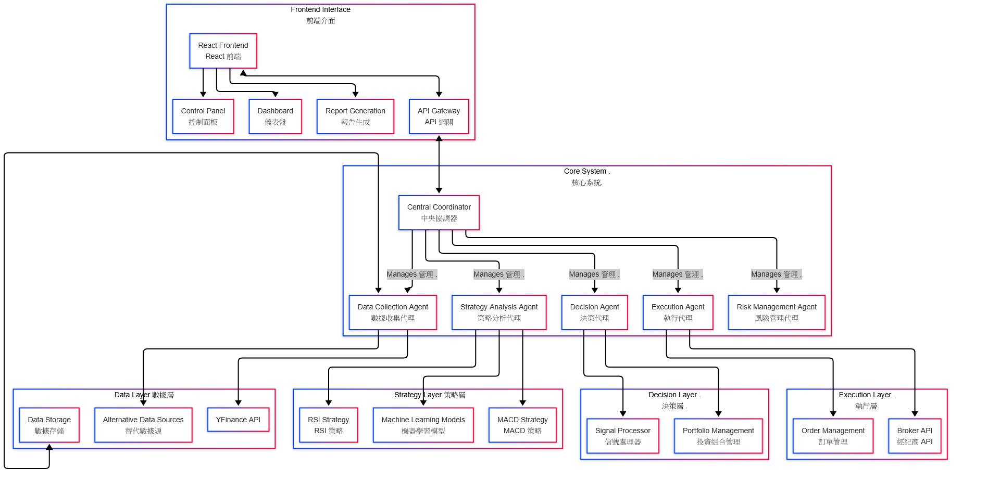

# Max Building this AI Quantitative Trading System (X.BIU.AI.QT)

一個模組化、可擴展的 AI 量化交易系統，結合多代理架構與現代前後端技術。

**This Project is still on the Progress ! Please DO NOT install in raw conditions.**

**Only the core algo and agents function is working (MACD, RSI, AI/ML suggestion).**

---

## 系統架構



---

## 主要目錄結構

```
backend/                  # 後端核心 Core backend
├── agents/               # 各種代理 Agents
│   ├── base_agent.py
│   ├── coordinator.py
│   ├── data_agent.py
│   ├── ...
├── api/                  # API 端點 API endpoints
│   └── main.py
├── utils/                # 工具與指標 Utilities & indicators
│   ├── analysis.py
│   └── indicators.py
├── config.py             # 配置 Configuration
...
frontend/                 # 前端 React 應用 React frontend
├── src/
│   ├── App.jsx
│   ├── index.jsx
│   └── components/
│       └── ...
├── public/
├── package.json
...
rust_modules/             # Rust 擴展（可選） Rust extensions (optional)
├── Cargo.toml
├── src/
│   └── lib.rs
...
README.md                 # 主文檔 Main documentation
requirements.txt          # Python 依賴 Python dependencies
setup.py                  # 安裝配置 Setup configuration
```

---

## 核心組件簡介

- **Coordinator**：協調各代理溝通與調度
- **DataAgent**：數據收集與預處理
- **StrategyAgent**：交易策略與分析
- **DecisionAgent**：決策生成
- **ExecutionAgent**：下單執行
- **RiskAgent**：風險監控
- **前端（React）**：用戶操作介面、儀表盤、報告

---

## 快速開始

1. 安裝 Python 依賴：
   ```bash
   pip install -r requirements.txt
   ```
2. 前端安裝依賴並啟動：
   ```bash
   cd frontend
   npm install && npm start
   ```

---

## 其他

- 詳細開發、部署與使用說明請見各子目錄 README。
- 歡迎 PR 與 issue。
