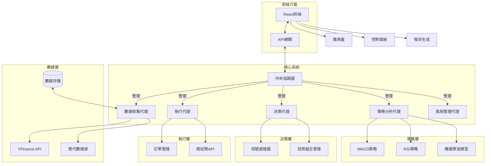

# SiuBiu-AI-Quant-System

在做了在做了, 這是個 Ai Quant System

## 系統架構

以下是 SiuBiu-AI-Quant-System 的系統架構圖：

## 系統組件說明

### 核心系統

- **中央協調器 (Coordinator)**: 負責管理和協調各個代理之間的通信和操作
- **數據收集代理 (DataAgent)**: 負責從各種數據源收集和處理數據
- **策略分析代理 (StrategyAgent)**: 實現各種交易策略和分析方法
- **決策代理 (DecisionAgent)**: 根據策略分析結果做出交易決策
- **執行代理 (ExecutionAgent)**: 負責執行交易訂單
- **風險管理代理 (RiskAgent)**: 監控和管理系統風險

### 前端介面

- **React 前端**: 提供用戶友好的 Web 界面
- **儀表盤**: 顯示關鍵指標和系統狀態
- **控制面板**: 提供系統配置和控制功能
- **報告生成**: 生成分析報告和交易記錄

## 開發環境設置

待補充...

## 使用說明

待補充...
