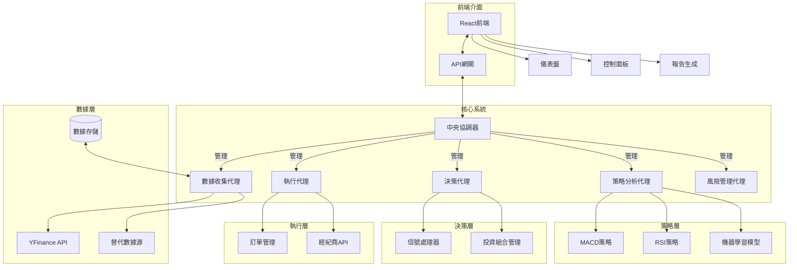

# XiaoBiu-AI-Quant-System

在做了在做了, 這是個 Ai Quant System

## 文件架構

```
BIU-AI-QUANT-SYSTEM
├── backend/                               # 後端核心代碼              # Backend Core Code
│   ├── agents/                            # 各種代理實現              # Various Agent Implementations
│   │   ├── __init__.py                    #                             
│   │   ├── coordinator.py                 # 中央協調器                # Central Coordinator
│   │   ├── base_agent.py                  # 代理基類                  # Base Agent Class
│   │   ├── data_agent.py                  # 數據收集代理              # Data Collection Agent
│   │   ├── macd_agent.py                  # MACD 策略代理             # MACD Strategy Agent
│   │   ├── decision_agent.py              # 決策代理                  # Decision Agent
│   │   ├── execution_agent.py             # 執行代理                  # Execution Agent
│   │   └── risk_agent.py                  # 風險管理代理              # Risk Management Agent
│   ├── utils/                             # 通用工具庫                # Utility Library
│   │   ├── __init__.py                    #                             
│   │   ├── indicators.py                  # 技術指標實現              # Technical Indicators Implementation
│   │   └── analysis.py                    # 分析工具                  # Analysis Tools
│   ├── api/                               # API 接口                  # API Interface
│   │   ├── __init__.py                    #                             
│   │   └── main.py                        # 主要 API 端點             # Main API Endpoint
│   └── config.py                          # 配置文件                  # Configuration File
├── frontend/                              # 前端代碼                  # Frontend Code
│   ├── public/                            # 靜態資源                  # Static Resources
│   ├── src/                               # 源代碼                    # Source Code
│   │   ├── components/                    # React 組件                # React Components
│   │   │   ├── Dashboard.js               # 儀表盤組件                # Dashboard Component
│   │   │   ├── ControlPanel.js            # 控制面板                  # Control Panel
│   │   │   ├── TradeHistory.js            # 交易歷史                  # Trade History
│   │   │   └── Portfolio.js               # 投資組合                  # Portfolio
│   │   ├── App.js                         # 主應用                    # Main Application
│   │   ├── index.js                       # 入口文件                  # Entry Point
│   │   └── styles/                        # 樣式文件                  # Style Files
│   ├── package.json                       # 依賴配置                  # Dependency Configuration
│   └── README.md                          # 前端文檔                  # Frontend Documentation
├── rust_modules/ (Optional)               # Rust 擴展模塊（可選）      # Rust Extension Modules 
│   ├── Cargo.toml                         # Rust 項目配置             # Rust Project Configuration
│   └── src/                               #                             
│       └── lib.rs                         # Rust 代碼                 # Rust Code
├── requirements.txt                       # Python 依賴                # Python Dependencies
├── setup.py                               # 安裝配置                   # Installation Configuration
└── README.md                              # 項目主文檔                 # Project Main Documentation
```

## 系統架構

以下是 XBiu-AI-Quant-System 的系統架構圖：



## 系統組件說明

### 核心系統

- **中央協調器 (Coordinator)**: 負責管理和協調各個代理之間的通信和操作
- **數據收集代理 (DataAgent)**: 負責從各種數據源收集和處理數據
- **策略分析代理 (StrategyAgent)**: 實現各種交易策略和分析方法
- **決策代理 (DecisionAgent)**: 根據策略分析結果做出交易決策
- **執行代理 (ExecutionAgent)**: 負責執行交易訂單
- **風險管理代理 (RiskAgent)**: 監控和管理系統風險

### 前端介面

- **React 前端**: 提供用戶友好的 Web 界面
- **儀表盤**: 顯示關鍵指標和系統狀態
- **控制面板**: 提供系統配置和控制功能
- **報告生成**: 生成分析報告和交易記錄

## 開發環境設置

待補充...

## 使用說明

待補充...
